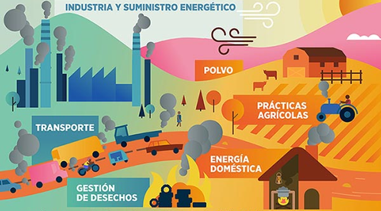
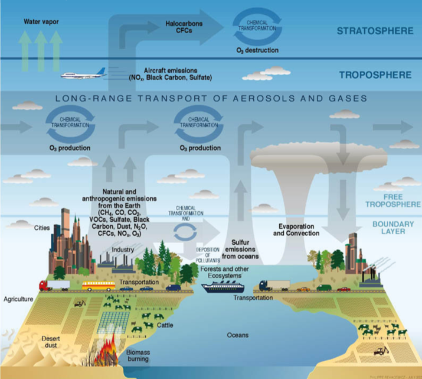
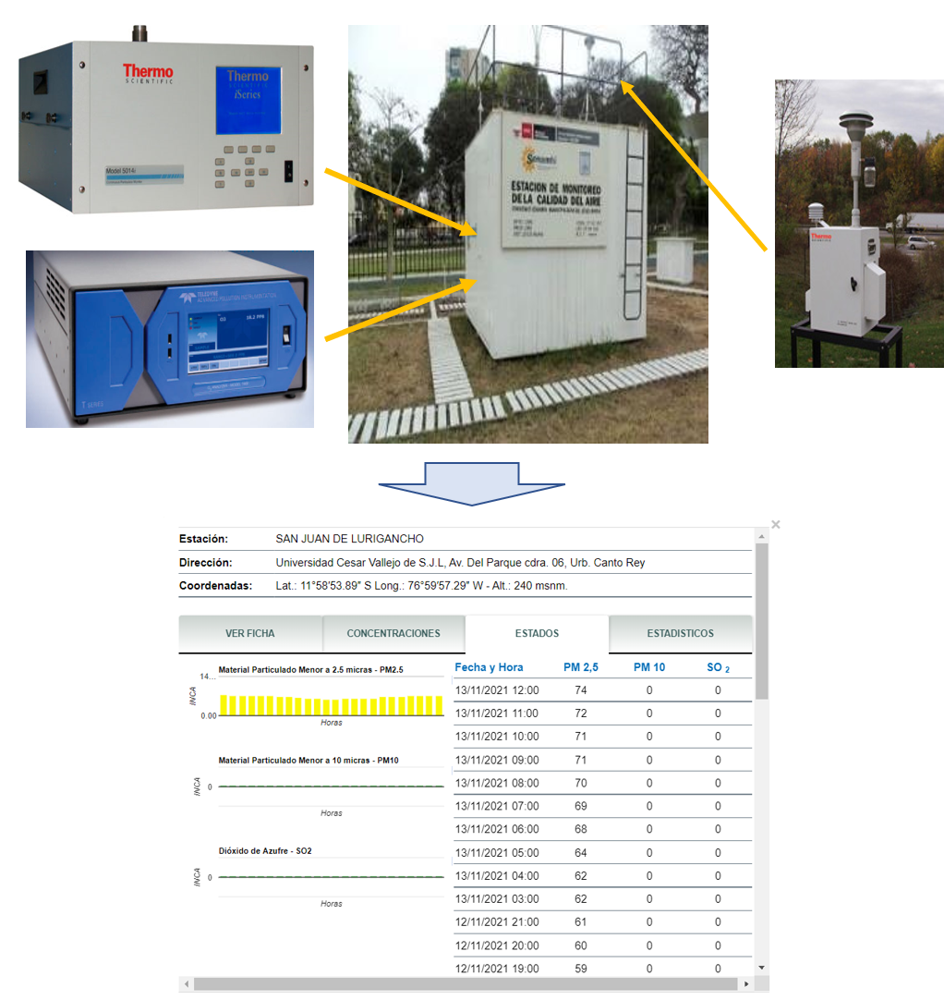

```{r child = "../setup.Rmd"}
```

```{r packages, echo=FALSE, message=FALSE, warning=FALSE}
# AGREGAR PAQUETES A UTILIZAR

```
class: center

## Acerca de mí

.left-column-image[
  
]

.left-column[
- Ingeniería ambiental / UNALM.
- Especialización en Data Science, Machine Learning y Deep Learning / UNALM.
- Consultor en ciencia de datos ambientales en el Centro Internacional de la Papa (CIP - CGIAR) en el área de Research Informatics Unit (RIU) y Asistente de recursos hídricos en SNC-Lavalin.
- Docente con más de 300 horas de experiencia en el dictado de cursos de Sistemas de Información Geográfica con ArcGIS, QGIS, Google Earth Engine, R y Python.
 ]

---

## ¿Qué es la calidad de aire?

- Se puede definir la calidad de aire como la condición del aire dentro de un espacio-tiempo determinados. 
- Una buena calidad de aire denota un entorno donde el aire es limpio, mientras que una mala calidad de aire se debe a la presencia de altas concentraciones de contaminantes atmosféricos.
- Según la Organización Mundial de la Salud (OMS), 9 de cada 10 personas en todo el mundo viven en lugares donde la calidad del aire supera los límites establecidos en la guía de calidad de aire de la OMS. 
- La calidad de aire se mide mediante el Indice de Calidad de Aire.


---

## Los contaminantes atmosféricos

- Son las partículas o gases presentes en el aire que implican riesgos a la salud o el ambiente en concentraciones elevadas.
- La Agencia de Protección Ambiental de EEUU (EPA), ha definido seis contaminantes atmosféricos con la categoría de "criterio" basados en su interacción y efectos sobre la salud humana y ambiente.
- Los contaminantes atmosféricos criterio son el **Material particulado (PM), Ozono (O3), Monóxido de carbono (CO), Óxidos de azufre (SOx), Óxidos de Nitrógeno (NOx) y plomo (Pb)**.




---

## La contaminación atmosférica



---

## Monitoreo de la calidad del aire




---

## ¿Qué es la programación?

- La programación es el proceso utilizado para idear y ordenar las acciones necesarias para realizar un proyecto de manera eficiente.
- En la actualidad el concepto se encuentra muy ligado a la informática.


---

## ¿Por qué aprender a programar?

- El mundo tecnológico se encuentra en constante crecimiento.
- La programación estimula el pensamiento lógico y crítico, la creatividad, la colaboración efectiva, el análisis sitemático y aprendizaje continuo.
- Los campos de aplicación de la programación son muy diversos.
- La pandemia por el COVID-19 ha cambiado el mundo laboral, posiblemente para siempre.


  


---

## ¿Por qué aprender R?

  

 <a href="https://trends.google.com/" class='center'> Acceder a Google Trends </a>

---

class: syllabus

## Contenido analítico

#### PARTE I: INTRODUCCIÓN A LA PROGRAMACIÓN CON R Y RSTUDIO 

**INTRODUCCIÓN A R**

-	¿Qué es R?
-	Características principales de R
-	¿Qué es RStudio?
-	Características principales de RStudio
-	Instalación de R y RStudio
-	Paquetes y sintaxis 

**MATEMÁTICAS BÁSICAS CON R**

-	Operaciones y funciones básicas
-	Cifras significativas y redondeo
-	Números reales y complejos

---

class: syllabus

**DATOS Y FUNCIONES EN R**

-	Tipos de datos
-	Estructura de datos
-	Importar y exportar datos
-	Horarios y fechas
-	Operadores relacionales y lógicos
-	Condicionales: if, else y else if
-	Loops
-	Funciones

---

class: syllabus

#### PARTE II: ANÁLISIS DE DATOS METEOROLÓGICOS Y CALIDAD DE AIRE 

-	¿Qué es la calidad de aire?
-	¿Qué es la contaminación atmosférica?
-	Tipos de contaminantes atmosféricos
-	Fuentes de contaminantes atmosféricos
-	Efectos de los contaminantes atmosféricos
-	La meteorología y la calidad de aire
-	Monitoreo de la calidad del aire
-	Obtención, procesamiento y análisis de datos meteorológicos
-	Obtención, procesamiento y análisis de datos de calidad de aire
-	Uso de la librería “openair”
-	Gráficos de series de tiempo	
-	Gráfico de rosas de viento y contaminación
-	Gráficos de calendario y tendencias


---

## Sistema de evaluación

- Trabajos encargados  &nbsp;  &nbsp;| ??%
- Examen teórico &nbsp;  &nbsp;  &nbsp;  &nbsp;  &nbsp;  &nbsp;  &nbsp; | 100%
- Proyecto final &nbsp;  &nbsp;  &nbsp;  &nbsp;  &nbsp;  &nbsp;  &nbsp;  &nbsp;  &nbsp;| ??% 

<br/>


---

class: inverse, center, middle

# INVESTIGACIÓN REPRODUCIBLE

---

## Git y GitHub

- [Git](https://git-scm.com/) es el sistema de control de versiones más utilizado en el mundo.
- [GitHub](https://github.com/) es una plataforma para alojar proyectos Git.


---

## RMarkdown

- [RMarkdown](https://rmarkdown.rstudio.com/) integra paquetes de R y herramientas externas con la finalidad de proveer un marco de referencia para la construcción de documentación completamente reproducible.


---

class: inverse, center, middle

# GRACIAS! <br/>  <a href="mailto: marvinjqs@gmail.com">  </a> 


