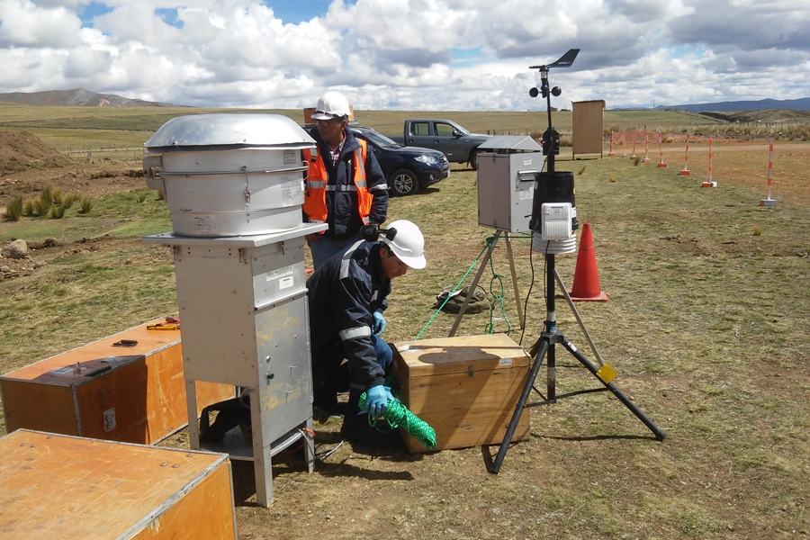
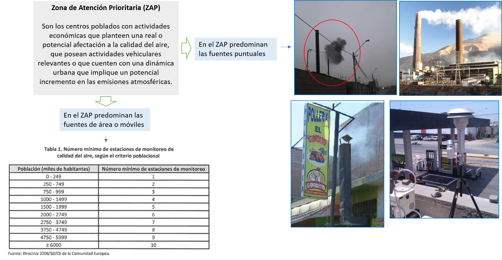
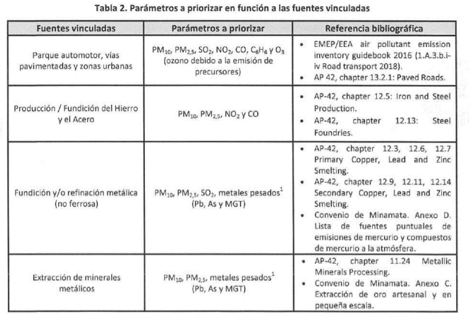
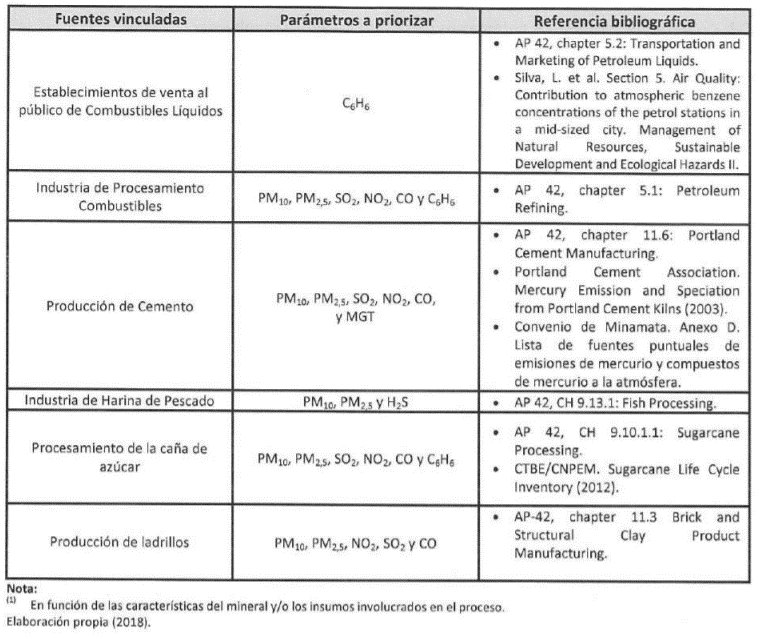
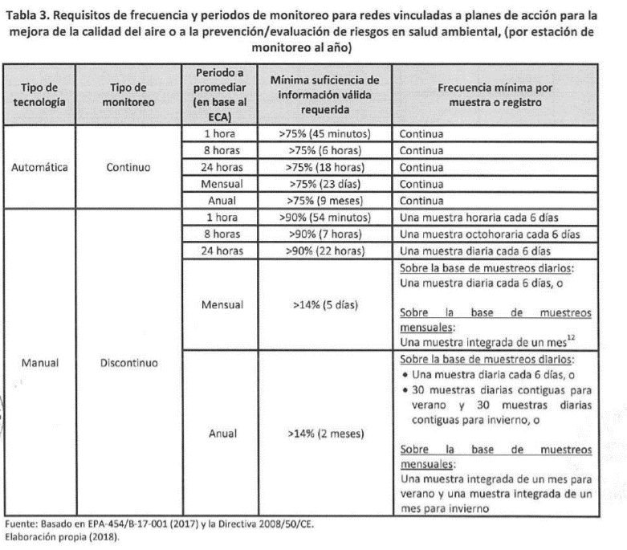
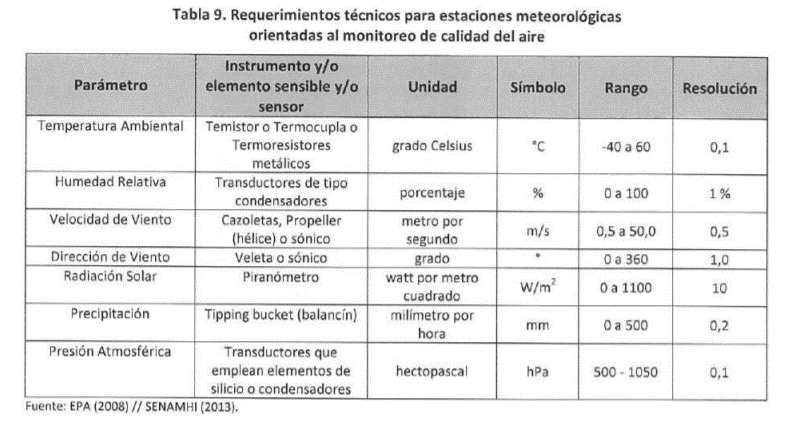
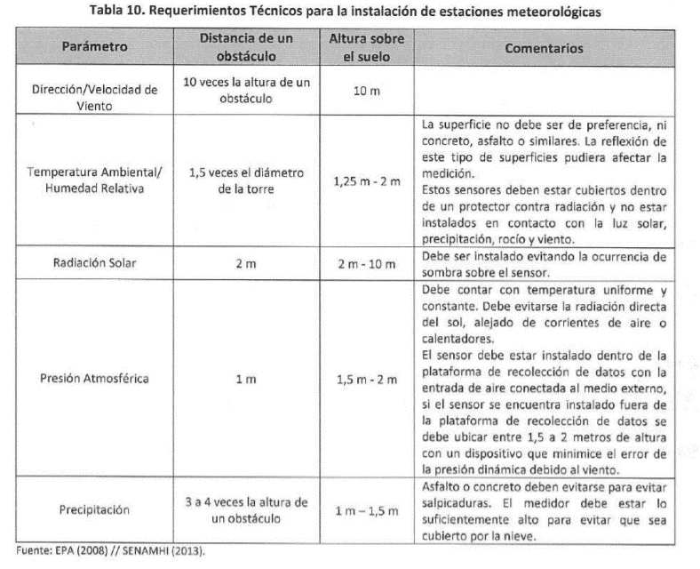
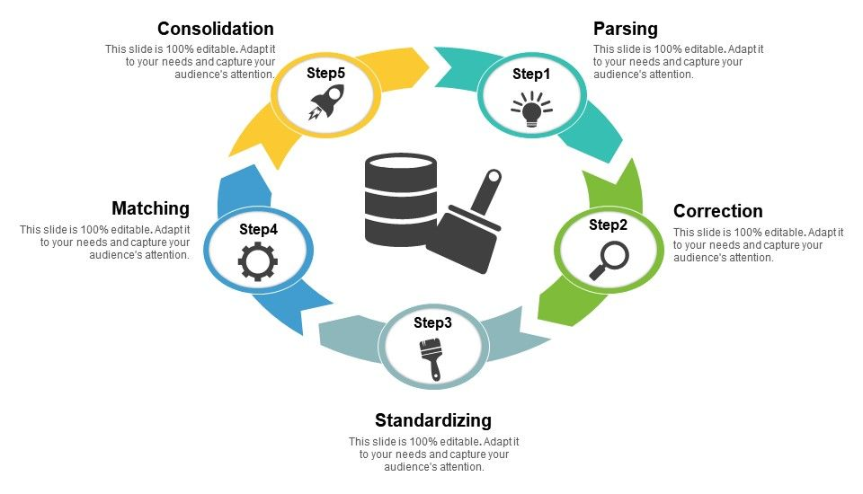

```{r child = "../setup.Rmd"}
```


```{r packages, echo=FALSE, message=FALSE, warning=FALSE}
# AGREGAR PAQUETES A UTILIZAR

```
class: inverse, center, middle

## CLASE 6 
### ANÁLISIS DE DATOS METEOROLÓGICOS Y CALIDAD DE AIRE

---

## Introducción

- La contaminación del aire representa un importante riesgo medioambiental para la salud. Mediante la disminución de los niveles de contaminación del aire los países pueden reducir la carga de morbilidad derivada de accidentes cerebrovasculares, cánceres de pulmón y neumopatías crónicas y agudas, entre ellas el asma (OMS, 2021).


---

## Monitoreo de la calidad de aire

- El monitoreo de la calidad del aire es la evaluación sistemática de los tipos y cantidades de los contaminantes presentes en el entorno (exterior o interior).
- Su finalidad es la obtención de datos de buena calidad para su posterior procesamiento y análisis.



---

## Protocolo de monitoreo de la calidad del aire


---

## Zonas priorizadas

- El Ministerio del Ambiente ha priorizado 31 zonas para poner en marcha «Planes de Acción para la mejora de la Calidad del Aire», con medidas para controlar las emisiones contaminantes, proteger la salud de las personas y la calidad del ambiente.



---

## Parámetros priorizados



---

## Parámetros priorizados



---

## Frecuencias y periodos



---

## Requisitos de los equipos



---

## Requisitos de los equipos



---

class: inverse, center, middle

### PROCESAMIENTO DE DATOS

---

## Limpieza de datos



---

## Limpieza de datos


---

## Cálculos aritméticos


---

## Cálculos aritméticos


---

## Cálculos aritméticos


---

## El paquete "openair"

- Son un conjunto de herramientas específicas para el análisis de datos meteorológicos y de calidad del aire de **código abierto**.
- El proyecto [**openair**](https://bookdown.org/david_carslaw/openair/) comenzó con la financiación del Consejo de Investigación del Medio Ambiente Natural del Reino Unido (NERC) hace más de 10 años.


---


class: inverse, center, middle

# GRACIAS! <br/>  <a href="mailto: marvinjqs@gmail.com">  </a> 


